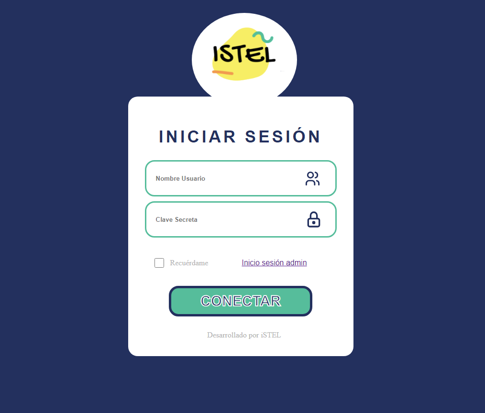

# App Verificación de Cuadros

# Proyecto Sistema de Verificación de Cuadros

 

## 🖥️ Interfaz

 

 

## 🖥️👤 Interfaz Login

[Ver App](./src/App.jsx)

 

## 📝 Organización

[Lista de Tareas para Realizar](https://www.notion.so/ORGANIZACI-N-PROYECTO-5d567970c66f43c28c5ec593ab76ea48?pvs=4)

[Tablas y Diagrama de Figma](https://www.figma.com/team_invite/redeem/nw6cWu9E8LQhNzZPLR2Zeo)